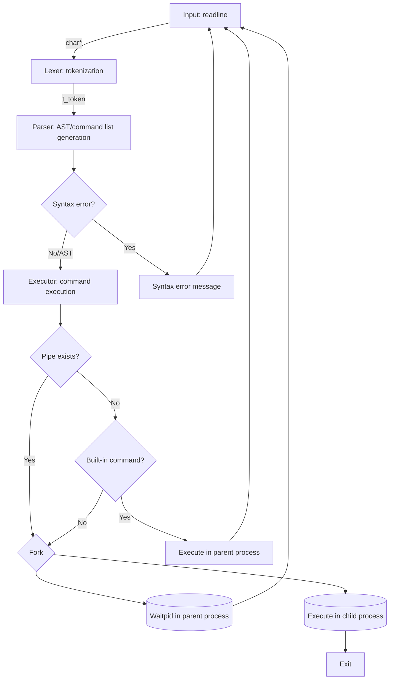

# Minishell
> Minimal UNIX shell built with C

### Key Features

- **Built-in Commands**: 'echo', 'cd', 'pwd', 'export', 'unset', 'env', 'exit'.
- **External Commands**: 'ls', 'cat', 'grep', 'wc' via '$PATH' variable or absolute/relative path.
- **Pipelining**: Supports pipes ('|') through asynchronous child process.
- **Redirection**: Supports input('<'), output('>', '>>'), and Heredoc('<<').
- **Signal Handling**: Supports 'Ctrl-C', 'Ctrl-D' to handle bash signals.
- **Environment Variables**: Supports '$VAR' and handles the '$?' exit status.

### Pipeline Flowchart

### Development Roadmap
- **Phase 1**: Environment & Input
    - Parse `envp` and build key-value linked list.
    - Setup input infinite loop.
- **Phase 2**: Lexer & Parser
    - Tokenize `char*` and generate AST.
- **Phase 3**: Executor & Built-ins
- **Phase 4**: Pipes & Redirection
- **Phase 5**: Debugging
