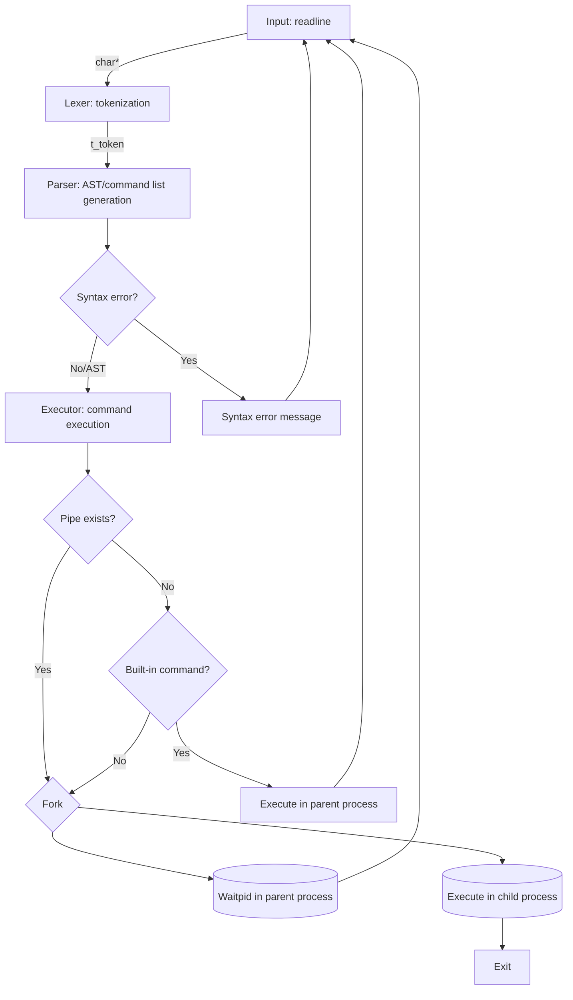

# Minishell
> Minimal UNIX shell built with C

<!-- 

 -->

## Key Features

- **Built-in commands:** `echo`, `cd`, `pwd`, `export`, `unset`, `env`, and `exit`
- **External commands:** Resolves commands using `$PATH` or direct absolute and relative paths
- **Pipelines:** Connects multiple commands using concurrent child processes and Unix pipes
- **Redirections:** Supports `<`, `>`, `>>`, and `<<`
- **Multiple redirections:** Applies chained redirections in left-to-right order
- **Environment expansion:** Expands `$VAR` and `$?` with quote-aware behavior
- **Here-documents:** Collects input before execution using temporary files
- **Signal handling:**
  - `Ctrl-C` interrupts the current input or foreground command
  - `Ctrl-\` is ignored at the prompt and handled by foreground commands
  - `Ctrl-D` exits the shell at the main prompt or ends heredoc input
- **Exit status handling:** Preserves command, pipeline, syntax, and signal exit codes

## Quick Start

### Docker

Docker provides the required Linux environment and GNU Readline dependency.

Build the image:

```bash
docker build -t minishell .
```

Run the shell:

```bash
docker run --rm -it --init minishell
```

Exit using:

```bash
exit
```

or press `Ctrl-D`.


## Pipeline Flowchart


```mermaid
graph TD
    Input[Input: readline]
    Lexer[Lexer: tokenization]
    Parser[Parser: AST/command list generation]
    Executor[Executor: command execution]

    Valid{Syntax error?}
    PipeExists{Pipe exists?}
    BuiltIn{Built-in command?}
    Fork{Fork}

    Input --> |char*| Lexer
    Lexer --> |t_token| Parser
    Parser --> Valid
    Valid --> |Yes| SyntaxError[Syntax error message]
    SyntaxError --> Input
    Valid --> |No/AST| Executor
    Executor --> PipeExists

    PipeExists --> |Yes| Fork
    PipeExists --> |No| BuiltIn
    BuiltIn --> |Yes| ParentProcess[Execute in parent process]
    ParentProcess --> Input
    BuiltIn --> |No| Fork
    Fork --> WaitPid[(Waitpid in parent process)]
    WaitPid --> Input
    Fork --> ChildProcess[(Execute in child process)]
    ChildProcess --> Exit[Exit]
```

### Development Roadmap
- **Phase 1**: Environment & Input
    - Parse `envp` and build key-value linked list.
    - Setup input infinite loop.
- **Phase 2**: Lexer & Parser
    - Tokenize `char*` and generate AST.
- **Phase 3**: Expander & Executor
- **Phase 4**: Pipes & Redirection
- **Phase 5**: Debugging


## Core Architecture & Troubleshooting

* **Issue 1: Spaces Inside Quoted Strings**
  * **Cause:** Splitting input only on spaces incorrectly separated words inside single and double quotes.
  * **Solution:** Added quote-state tracking so that only unquoted spaces divide tokens.

* **Issue 2: Quote Preservation During Expansion**
  * **Cause:** Removing quotes too early discarded information needed for variable expansion and word splitting.
  * **Solution:** Preserved quote information through tokenization and expansion, then removed quotes during the final splitting stage.

* **Issue 3: Chained Redirections Applied in the Wrong Order**
  * **Cause:** Each new redirection wraps the previous AST node. Traversing from the root caused the last redirection to be applied first. For example, `echo hello > a.txt > b.txt` incorrectly wrote the output to `a.txt`.
  * **Solution:** Extracted the executable node and recursively applied redirections from the innermost node outward. This keeps the original left-to-right order.

* **Issue 4: Standard Input and Output Were Not Restored**
  * **Cause:** `dup2()` replaces the shell's current stdin or stdout, so the next command could still use the previous redirected file.
  * **Solution:** Saved stdin and stdout with `dup()` before applying redirections, then restored them with `dup2()` after the command finished.